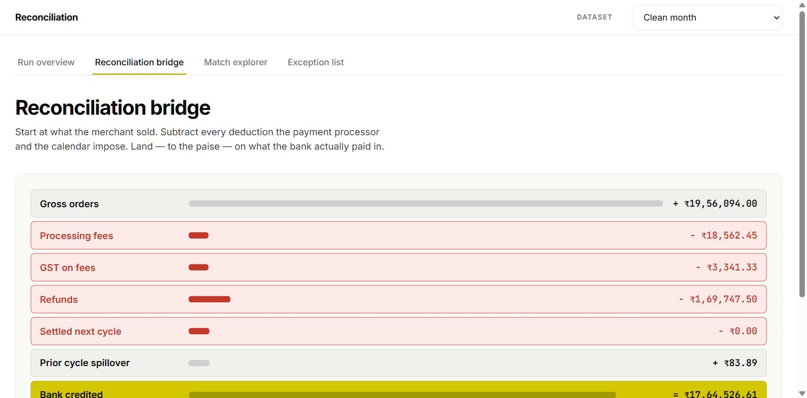
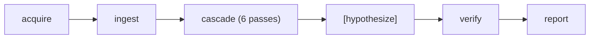
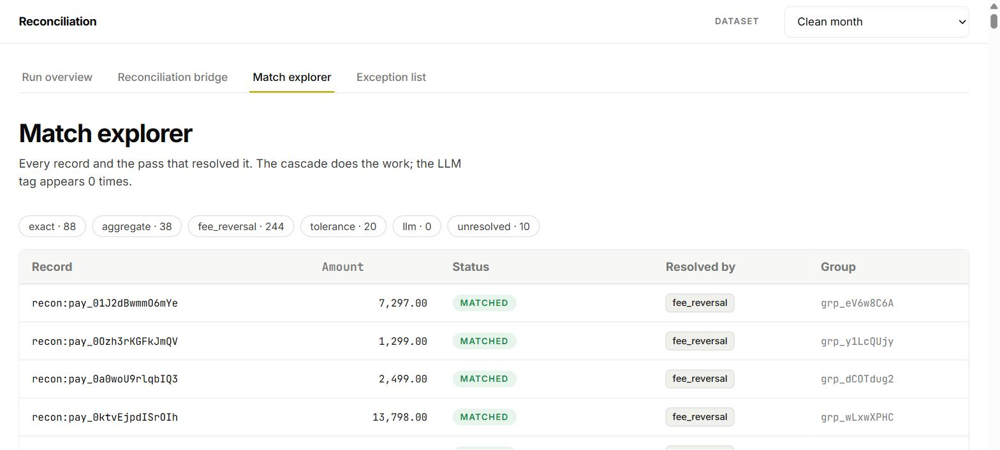
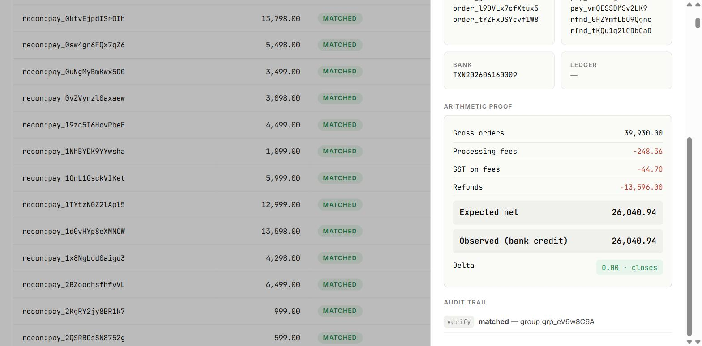
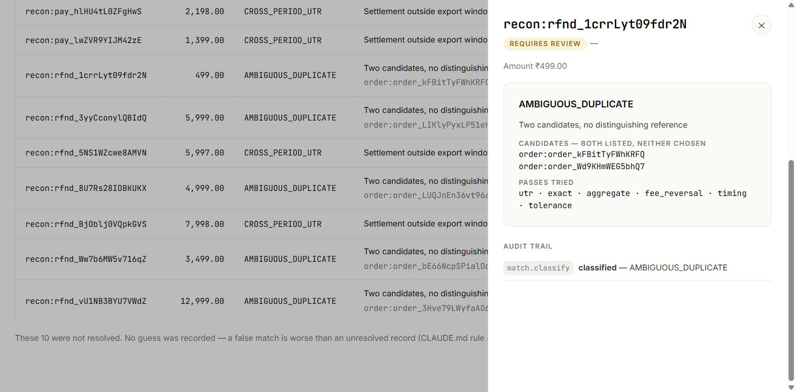

# Multi-source financial reconciliation

> Four systems disagree about the same money. This pipeline reconciles 400 records
> across all four, explains every rupee of the gap, and hands back the ones it could
> not resolve — with reasons.



A merchant's order system, Razorpay's settlement recon report, the bank statement, and
the accounting ledger never agree, because fees, taxes, T+2 settlement delays, refunds
and reversals distort the numbers at every step. Reconciliation is proving these four
describe the same money. It is done monthly, by hand, in a spreadsheet, by nearly every
business that takes online payments.

Built for the **Razorpay AI Buildathon 2026, Track 04 — AI Finance Controller**,
direction: multi-source reconciliation.

---

## Results

Scored against a sealed answer key that only `report/scoring.py` may open, and only after
matching completes.

### Metric definitions (used verbatim in code, this README, and the video)

| Metric | Definition |
|---|---|
| **Match rate** | matched **and correct against the sealed key** ÷ 400 |
| **Match precision** | correct matches ÷ all matches made |
| **False match rate** | incorrect matches ÷ all matches made |
| **Unresolved rate** | records sent to exceptions ÷ 400 |
| **Throughput** | records/sec, separately for cascade and LLM |

The denominator is always the 400 recon lines. The 5 unrelated bank debits per run are
`NOT_A_SETTLEMENT` — excluded, in neither numerator nor denominator.

### The four comparisons, every run

| Dataset | Naive baseline | Cascade (no LLM) | Cascade + LLM | Resolvable ceiling | Achievable ceiling |
|---|---|---|---|---|---|
| `clean-august` | 126 / 400 (31.5%) | **367 / 400 (91.75%)** · precision 94.10% | 367 (+0) | 389-391 (97.25-97.75%) | 384 (96.0%) |
| `heavy-refunds` | 80 / 400 (20.0%) | **287 / 400 (71.75%)** · precision 88.04% | 287 (+0) | 389-391 (97.25-97.75%) | 323 (80.75%) |
| `holiday-skew` | 121 / 400 (30.25%) | **346 / 400 (86.5%)** · precision 90.58% | 346 (+0) | 389-391 (97.25-97.75%) | 376 (94.0%) |
| `high-ambiguity` | 152 / 400 (38.0%) | **307 / 400 (76.75%)** · precision 83.20% | 307 (+0) | 368-374 (92.0-93.5%) | 356 (89.0%) |

Naive baseline = exact `order_id` + stated fee + exact UTR + net closes, with no
requirement that the whole settlement close together.

The **resolvable** ceiling is a range, not a flat number, because 0-2 of each run's
`ambiguous` records (0-6 in `high-ambiguity`) are `CONTRADICTORY_LEDGER` — they close
correctly against the closing equation (which never reads ledger data) even though the
sealed key marks them unresolvable, so the honestly achievable range depends on how many
happen to close in a given run (`reference/master_specification.md` §8.2,
`docs/challenges-log.md` C-008).

**The achievable ceiling is the tighter, more honest number.** `resolvable: true` in the
sealed key means "a human, given unlimited context, could correctly attribute this record
to its settlement" — it does not mean the settlement has a bank transaction to close
against at all, and the closing equation requires exactly one. On `heavy-refunds`, **66 of
389 key-resolvable records belong to 13 settlements with zero bank transactions anywhere
in the source data** — a bank credit simply never lands in the export window for them.
**The cascade closes 100% of the achievable set on every dataset** — 384/384, 323/323,
376/376, 356/356, verified independently outside `report/scoring.py` — so the gap between
`matched` and `achievable` is entirely the already-documented `CONTRADICTORY_LEDGER` /
`CROSS_PERIOD_UTR` scoring poison below, never a missed match (`docs/challenges-log.md`
C-018).

**heavy-refunds, reframed:** not "71.75% against a 97.25% ceiling" but **matched 100% of
every record achievable from the data; the remaining 89% of its unresolved records have no
bank transaction in the export window at all** — a designed data characteristic (heavy
refund volume pushes many settlements' bank credit outside the window), not a capability
gap.

**Cascade throughput: ~9,800–10,900 records/sec**, single core, single thread
(mean of 120 runs; `fee_reversal` is ~47% of it). Scaling analysis, including where this
breaks first and the fix, is in `reference/master_specification.md` §29.1.

---

## The philosophy

**The LLM proposes. The arithmetic disposes.**

Every match — whether the deterministic cascade found it or an LLM suggested it —
becomes a match only when a single verifier recomputes the closing equation from source
records and it balances. There is no confidence threshold, no "high confidence" bypass,
no fast path. A record is either matched **with a closing arithmetic proof**, or it goes
to the exception list **with a specific reason**. There is no third state, and no guess
is ever recorded — a false match is worse than an unresolved record, because an
unresolved record gets human attention and a false match never will.



*Pipeline stage flow, `reference/master_specification.md` §3.3 — hypothesize is optional
and skipped entirely without an API key.*

---

## The LLM's exact contribution: **0 records out of 400**, published

`--no-llm` and a live LLM run produce **identical** match rates on all four datasets. The
residual the LLM runs on is entirely `CROSS_PERIOD_UTR` (the settlement is outside the
export window — the bank record is genuinely absent) and `AMBIGUOUS_DUPLICATE` (a
dashboard refund with no order reference). Nothing in the source data lets any model
resolve these.

The clearest evidence is a live, unscripted run, not a staged demo. On
`heavy-refunds` (2026-09-04, live `openai/gpt-oss-20b`, no injection, no scripted model),
of 18 residual clusters, **4 produced a confident proposal — and the verifier rejected
all 4.** Every rejection, straight from `audit_log`:

| group | model's claim | delta |
|---|---|---|
| `grp_llm005` | payment and order match exactly, closing the settlement | ₹1,299.00 |
| `grp_llm006` | shared UTR, arithmetic balances match | -₹3,225.94 |
| `grp_llm010` | shared UTR, amounts reconcile to a net of ₹7,999.00 | -₹9,697.00 |
| `grp_llm016` | shared UTR, payment credits equal net of orders minus fees/tax/refunds | -₹6,930.40 |

Every one named no bank transaction (`observed_net: 0`) — these are genuinely
cross-period settlements, so there is none to name — and the verifier's delta lands
exactly on the real settlement net every time. A separate live run on the same
residual, minutes apart, produced proposals from a different subset of clusters (5
instead of 4) — the model is called live and unscripted, so exactly which clusters
produce a confident (wrong) grouping varies run to run. That variance is reported
honestly, not smoothed over: in every run captured, the number resolved is 0. Full
detail, including the other independent instance, in `docs/challenges-log.md` C-014
and C-017.

A bounded AI layer that resolves 0 of 400 is **evidence for the architecture**: the
deterministic cascade already found everything the data supports, and the model was given
no opening to fabricate. Hiding a small number invites exactly the suspicion this track
screens for.




---

## The honest exception list

Unresolved records per run: **10 / 74 / 18 / 31**. Every one carries a specific reason
code — `NO_CANDIDATE` is 0 in every run. `AMBIGUOUS_DUPLICATE` records list **all**
candidate orders (usually two; occasionally three where the data is genuinely that
ambiguous) and pick none; naming the ambiguity precisely is the deliverable.

For example, `clean-august`'s `recon:rfnd_1crrLyt09fdr2N` (₹499.00): reason
`AMBIGUOUS_DUPLICATE`, candidates `order:order_kFBitTyFWhKRFQ` and
`order:order_Wd9KHmWEG5bhQ7` — both listed, neither chosen. Screen 4 of the dashboard
shows exactly this, with the footer line *"These 10 were not resolved. No guess was
recorded."*



### Known answer-key defects — reported, not fixed

The sealed key marks some records unresolvable on the basis of a ledger entry the closing
equation does not read, or a bank record that is demonstrably in the statement. These
records close correctly and **will** be matched, and scoring counts them as false
matches. Per run this accounts for the entire false-match count:

- **`CONTRADICTORY_LEDGER`** — 2 / 2 / 2 / 6 payments per run. Order, stated fee,
  settlement and bank transaction all present; the closing equation never reads ledger
  data.
- **`CROSS_PERIOD_UTR` in a present settlement** (`docs/challenges-log.md` C-009) — one
  settlement per run (4 / 1 / 4 / 7 lines) the key calls "no bank record present" while
  the bank record is in the statement.

Detecting these would require inferring how the data was generated, which the
generator/matcher firewall forbids. Under strict whole-group scoring each poisoned record
drags its entire settlement, so precision reads 83–94% rather than ~99%. **There are zero
genuine split/merge errors among resolvable records in any run** — every false match
traces to one of these defects. See `docs/challenges-log.md` C-009 and
`reference/master_specification.md` §13.8.

---

## Tolerance constants — fixed before measurement, never widened after

Echoed into every `results.json` and shown in the dashboard, so no allowance is invisible.

| Constant | Value | Justification |
|---|---|---|
| Amount delta per derived line | **2 paise** | A settlement whose payments all carry a *stated* fee must close at delta 0 exactly — a stated fee cannot drift. Only a fee **recovered** by `fee_reversal` can be off, by ≤1 paise on the fee and ≤1 on the tax (both round half-up independently). The budget scales with the number of derived member payments; it is not a flat per-settlement number, and it was never needed to close anything measured. |
| UTR suffix truncation | **2 digits** | A bank formatting defect drops trailing UTR digits in some description strings; 2 covers the defect actually in the datasets (`manifest.json` `truncated_utr` = 2/run) without letting a short prefix guess a whole UTR. Requires a **unique** prefix match — a truncated UTR matching two settlements is ambiguity, not a match. |
| Ledger posting lag | **1 day** | Accountants book same-day or next-day (~8% of entries are one day late). This only widens which ledger entry is *attached to* an already-resolved group for display — it never touches the closing equation or a recon-line match decision. |

---

## A recurring lesson

`docs/challenges-log.md` C-005 through C-011, C-017 four days later, and C-018 in a
post-submission adversarial audit, were all found the same way: running a pass against
the real frozen datasets and checking its output against an independently-computed
expectation, not trusting that green tests — or a prior "confirmed" note in this same
log — meant the pipeline worked. The sharpest instance is C-006 — 39 of 39 tests passing
while the cascade's writes never actually committed to disk, because every test used a
single open connection that could read its own uncommitted transaction. The bug was
invisible to the test suite by construction; it was only caught by running the CLI as a
real process, letting it exit, and opening `run.db` fresh from a second connection. C-018
is the same discipline turned on the project's own headline number: the published ceiling
counted records a human could attribute but the architecture could never arithmetically
close, and it was only caught by an audit explicitly instructed to re-derive every claim
from source data rather than inherit it. The pattern repeats deliberately, not
accidentally: this project treats "the tests are green," "the last audit said so," and
"the product works" as three different claims, all of which have to be checked.

---

## Design decisions

### Why not the JVM?

Java is the conventional choice for a fintech back office — mature decimal arithmetic
(`BigDecimal`), strong typing, the ecosystem a bank already runs. It was considered for
those reasons. Python was chosen deliberately: the domain literacy this task rewards —
T+2 settlement cycles, unannounced fee-rate changes, GST-on-fee rounding — is expressed
in the pass logic, not the runtime, and the arithmetic is **integer paise end to end**
(`int`, never `float` or `Decimal`, enforced by `tests/test_money.py`), so `BigDecimal`
buys nothing here. Five pinned dependencies a reviewer can audit in an afternoon reads as
deliberate; thirty reads as assembled. The role is AI Builder Intern — the stack itself
is a signal.

### Why no auth?

> This is a scheduled internal batch job, not a user-facing service. There is no
> multi-user surface, so there is no auth layer, and adding one would be theatre.

Bad auth in a fintech repo is worse than none. What *is* addressed: secrets in the
environment only (`.env` gitignored); every free-text field treated as hostile and
delimited in prompts, never interpolated into instructions; the LLM assumed adversarial
and backstopped by the verifier; idempotent re-runs; an append-only audit log with a
per-record trail; and a documented least-privilege production posture (read-only merchant
credential).

### Scope decision: the record drawer is key-level, not field-level

Clicking a record shows its source keys grouped by prefix plus the full proof and audit
trail — not each source row's own field columns (amount/date/narration), since that
data isn't in `results.json` and adding it would mean a new, undocumented schema field
(rule 12). Accepted as final for this submission, not a forgotten gap
(`reference/master_specification.md` §23.5).

### Architecture

Modular monolith, pipes-and-filters, single process, single-threaded. One SQLite file per
run. Static frontend reading a committed JSON artifact.

`match/`, `hypothesize/` and `verify/` **never** import from the data generator — if the
matcher needs a fee slab or a holiday calendar, it derives it from observed data. That
one import would silently void the entire result; `tests/test_firewall.py` enforces it.

**How the holiday calendar is inferred (`match/timing.py`, §13.5):** every distinct
`settled_at` date is treated as a business day; a weekday inside the window with **no
settlement at all** is a candidate holiday — at ~6.6 recon lines per settlement day, an
empty weekday is evidence, not noise. Each candidate is validated by checking that
`add_business_days(capture_date, 2) == settled_date` still holds for the payments it
would explain (T+2 settlement, with the capture date rolling forward a day for anything
captured at or after 18:00 IST); a candidate that causes widespread mismatch is dropped.
The calendar is accepted only if it explains ≥95% of payments with both timestamps —
below that, the pass records low confidence and lets the affected records fall through
to `tolerance` rather than force a bad calendar.

Full architecture, schemas, and pass algorithms: `reference/master_specification.md`.

---

## Synthetic data disclosure

The four datasets in `data/` are **synthetic**, generated from a simulated business
process (not injected noise), frozen, and committed. They are never regenerated —
tuning the generator after seeing a match rate would invalidate every number here.

**The fee schedule is invented.** UPI 0%, netbanking 1.75%, wallet 2.25%, and a card rate
that moves 2.00% → 1.90% partway through the window — these are a plausible *shape*, not
Razorpay's real pricing, and the pipeline never presents them as such. The matcher does
not know them; `fee_reversal` rediscovers them from observed stated fees by change-point
detection and validates any inferred rate against 100% of the stated-fee lines before
using it.

---

## Razorpay integration status — VERIFY

The pipeline is shaped around `GET /v1/settlements/recon/combined`. **The live adapter
ships as a documented stub.** Verified against the real endpoint with test-mode
credentials: it authenticates and returns a valid but empty collection
(`{"entity":"collection","count":0,"items":[]}`) — Razorpay test mode generates no
settlements, since settlements require real money movement to a verified bank account.
There is nothing for a live adapter to return in this environment, so
`RazorpayAdapter` raises `SourceUnavailable("live adapter not implemented")` behind a
correct interface, and `--source fixture` (the default) reads the frozen datasets.

An honest stub behind a clean interface is a better signal than a fabricated integration.

**One further external dependency changed under us:** the pinned LLM model
`llama-3.3-70b-versatile` was retired from Groq's catalogue between spec-freeze and the
LLM phase. The layer degrades cleanly to `HYPOTHESIS_LAYER_UNAVAILABLE` and every run
still completes; the default is now `openai/gpt-oss-20b`, and the model's identity sits
behind a one-method interface so a swap is one environment variable
(`docs/challenges-log.md` C-013).

---

## Run it

Requires **Python 3.11+** (tested on 3.12) and **Node 18+** (tested on Node 24) for the
frontend. No other tooling assumed.

```bash
python -m venv .venv && .venv\Scripts\activate      # Windows; use `source .venv/bin/activate` on macOS/Linux
pip install -r requirements.txt                      # 5 runtime dependencies, all pinned
python -m recon run --dataset all --no-llm
```

A fresh clone runs the full deterministic pipeline over the four committed datasets with
**zero environment configuration** — no API key, no `.env`, no network. Every environment
variable is optional. A virtual environment is optional too — the commands above work with
a global interpreter — but recommended so `requirements.txt`'s pins don't collide with
anything else on the machine.

```bash
python -m recon run --dataset clean-august          # one dataset, with LLM if GROQ_API_KEY is set
python -m recon run --dataset all --no-llm          # all four, deterministic only
python -m recon report --dataset clean-august --html # re-emit results.json + static HTML
python -m recon inject --scenario llm-hallucination  # failure-injection scenarios
python -m recon validate --dataset all               # dataset invariant checks
pytest                                              # 95 tests
ruff check .

cd frontend && npm install && npm run dev            # the dashboard, live-reloading (reads results.json)
# or, to serve the production build instead of the dev server:
npm run build && npm run preview                     # builds to dist/, then serves it locally
```

`results.json` for all four datasets is committed under `data/<run>/`. **Running `recon
run` regenerates the run's `results.json`** (only its wall-clock timing fields change,
per `docs/challenges-log.md` C-015) — a clean working tree after a run showing exactly
that one file modified is expected, not a bug; `git checkout -- data/` restores it.

---

## Repository map

| Path | What |
|---|---|
| `recon/` | the pipeline — `models`, `adapters`, `ingest`, `match` (6 passes), `hypothesize` (LLM), `verify`, `report`, `audit`, `inject` |
| `recon/generate/` | the synthetic data generator — imported by **nothing** |
| `data/<run>/` | frozen sources + `answer_key.json` (sealed) + committed `results.json` |
| `frontend/` | static Vite + React dashboard |
| `tests/` | 95 tests; 8 protected tests that must never be skipped or weakened |
| `reference/master_specification.md` | the single authoritative technical document |
| `reference/design.md` | the frontend design system |
| `docs/project-progress.md` | phase-by-phase build record |
| `docs/challenges-log.md` | every error, wrong turn and surprise, logged as it happened |

## License

MIT.
